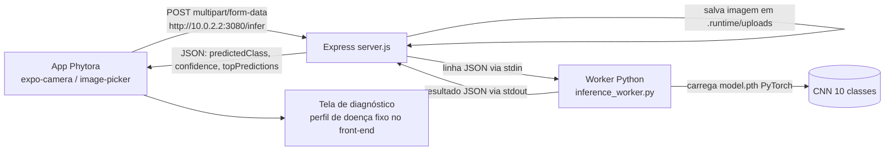

# Phytora — Como funciona (v1)

> **Versão 1** — snapshot referente ao commit `a34b51f` ("PD entregue"). Este documento descreve o **estado do código nesse momento** (não o plano de produto do `Phytora/README.md`).

O repositório tem dois projetos independentes, sem nenhuma automação que os conecte além de uma chamada HTTP fixa:

```
Phytora/        → app mobile (React Native + Expo)
PhytoraAPI/     → API de inferência (Node.js + worker Python/PyTorch)
```

---

## 1. Fluxo do app (`Phytora/`)

Rotas do Expo Router, em `src/app/`, nesta ordem de navegação:

```
index → splash (2.5s) → welcome → culture-selection → camera → diagnosis
```

- **`index.tsx`** — só redireciona para `/splash`.
- **`splash.tsx`** — mostra a imagem de splash por 2.5s e navega para `/welcome`.
- **`welcome.tsx`** — tela com o título "Phytora" e três botões: "Análise Rápida" (funcional, vai para `/culture-selection`), "Cadastre-se" e "Já tenho uma conta" (**sem ação — `onPress={() => {}}`**, não existe cadastro/login implementado).
- **`culture-selection.tsx`** — mostra 4 cards (Soja, Arroz, Trigo, Milho). **Todos os cards navegam para `/camera` sem passar qual cultura foi escolhida** — a seleção de cultura hoje é só visual, não influencia a captura nem a inferência.
- **`camera.tsx`** — abre a câmera do dispositivo (`expo-camera`) ou permite escolher uma imagem da galeria (`expo-image-picker`). Ao capturar/escolher uma imagem, chama `inferImage()` e navega para `/diagnosis` passando o resultado da API serializado em JSON via query param.
- **`diagnosis.tsx`** — recebe o resultado da inferência e exibe um "perfil de doença" pré-cadastrado com base na classe prevista (`predictedClass`).

### Camada de rede (`src/services/inference.ts`)

- Monta um `FormData` com a imagem e faz `POST` para `http://10.0.2.2:3080/infer`.
- **A URL da API está hardcoded** e `10.0.2.2` é o alias que o **emulador Android** usa para acessar o `localhost` da máquina host — ou seja, hoje o app só funciona testado no emulador Android (ou precisa ser editado manualmente para rodar em device físico/iOS/web).
- Não há tratamento de erro de rede na UI (só `console.error`), nem loading state durante a chamada.

### Diagnósticos conhecidos pelo app (`diagnosis.tsx`)

O app tem perfis de texto (sintomas, ações recomendadas, cores) fixos no código para 4 classes:

| classe retornada pela API | doença mapeada |
|---|---|
| `ferrugem` | Ferrugem Asiática |
| `mancha_alvo` | Mancha-alvo |
| `mosaico` | Mosaico (virose) |
| `septoria` | Septoria |

Qualquer outra classe cai num perfil genérico ("Diagnóstico complementar"). **Isso é uma lista fixa no front-end**, dissociada de qualquer coisa configurável vinda da API.

### Stack do mobile

- Expo SDK 56 + Expo Router (file-based routing) + TypeScript
- React 19.2 / React Native 0.85
- `expo-camera`, `expo-image-picker`, `expo-file-system` (upload da imagem)
- Sem gerenciamento de estado global, sem autenticação, sem persistência local (AsyncStorage/SQLite) — cada tela só passa dado adiante via params de rota.

---

## 2. API de inferência (`PhytoraAPI/`)

Serviço HTTP simples em **Node.js/Express** que delega a inferência para um **worker Python** rodando como subprocesso.

### Como o pipeline funciona (`server.js`)

1. No boot, o `server.js` **escreve um arquivo Python** (`.runtime/inference_worker.py`) a partir de uma string embutida no próprio `server.js`, e sobe esse worker com `spawn(python, [worker, --model, models_saved/model.pth])`.
2. O worker Python carrega o checkpoint `.pth` (PyTorch), instancia a arquitetura `CNN` definida no código e fica em loop lendo linhas JSON do `stdin` / escrevendo respostas JSON no `stdout` (protocolo simples "uma requisição por linha").
3. O Express expõe **um único endpoint**: `POST /infer`, que recebe `multipart/form-data` com o campo `image` (via `multer`, limite de 8 MB, apenas JPEG/PNG/WEBP/BMP).
4. Ao receber a imagem, o servidor grava o arquivo em `.runtime/uploads/`, envia o caminho para o worker via stdin (com um `id` de correlação), aguarda a resposta (timeout de 30s) e **apaga o arquivo temporário** ao final (sucesso ou erro).
5. A resposta devolvida ao app é: `{ ok, predictedClass, predictedIndex, confidence, topPredictions[] }`.

### Arquitetura do modelo (embutida tanto em `server.js` quanto em `.runtime/inference_worker.py`)

```python
Conv2d(3→32) → ReLU → MaxPool2d
Conv2d(32→64) → ReLU → MaxPool2d
Flatten → Linear(64*32*32 → 128) → ReLU → Linear(128 → 10)
```

- Entrada: imagem redimensionada para `input_size` (padrão 128×128) definido no checkpoint, sem normalização além de `ToTensor()`.
- Saída: 10 classes fixas na camada final (`Linear(128, 10)`), com nomes de classe lidos do próprio checkpoint (`classes` salvo dentro do `.pth`) — **se o checkpoint não trouxer essa lista, as classes aparecem como `classe_indice_N_sem_nome_no_checkpoint`**.
- Roda em CUDA se disponível, senão CPU.
- **Observação importante**: a arquitetura da CNN está duplicada (hardcoded) em dois arquivos (`server.js` como string Python, e `.runtime/inference_worker.py` gerado por ele). Ela precisa bater exatamente com a arquitetura usada no treinamento do `.pth`, senão o `load_state_dict` falha.

### Como rodar (resumo do `PhytoraAPI/README.md`)

```bash
npm install                      # deps do Node
python -m venv .venv && .venv\Scripts\Activate.ps1   # (Windows)
pip install -r requirements.txt  # torch, torchvision, pillow
# copiar o modelo treinado para PhytoraAPI/models_saved/model.pth
npm start                        # sobe em http://localhost:3080
```

Se `models_saved/model.pth` não existir, a API recusa subir (`process.exit(1)`).

---

## 3. Como as duas partes se conversam hoje



Não existe nenhum backend intermediário de negócio (planos, assinatura, autenticação, histórico) — o que o `README.md` descreve como modelo de negócio (planos Gratuito/Premium/Fruticultura/Profissional) **ainda não existe em código**; hoje é apenas: capturar foto → mandar pra API → mostrar resultado.

---

## 4. Limitações e pontos soltos observados no código atual

- Seleção de cultura (`culture-selection.tsx`) não é usada em lugar nenhum do fluxo — é decorativa no momento.
- Botões "Cadastre-se" e "Já tenho uma conta" não fazem nada (`onPress={() => {}}`).
- URL da API hardcoded para o alias do emulador Android (`10.0.2.2`), não configurável por variável de ambiente/env do Expo.
- Sem tratamento de erro visível ao usuário (erros só vão para `console.error`/`console.log`).
- Sem autenticação, planos, histórico de diagnósticos ou qualquer persistência — tudo descrito no README como modelo de negócio é apenas plano, não implementação.
- O modelo CNN tem 10 classes de saída fixas no código, mas o app só tem textos explicativos para 4 delas (`ferrugem`, `mancha_alvo`, `mosaico`, `septoria`); as demais caem num fallback genérico.
- A definição da arquitetura da rede está duplicada entre `server.js` e o worker gerado — mudar uma sem mudar a outra quebra o carregamento do checkpoint.
- `PhytoraAPI/.runtime/` contém arquivos de execução (worker gerado e uploads temporários) que são artefatos de runtime, não código-fonte versionado intencionalmente — e o `.gitignore` do `PhytoraAPI` não cobre essa pasta, então **imagens reais enviadas durante testes já foram commitadas no repositório** (`PhytoraAPI/.runtime/uploads/*.jpg`), assim como o peso do modelo (`models_saved/model.pth`) como arquivo binário versionado.
